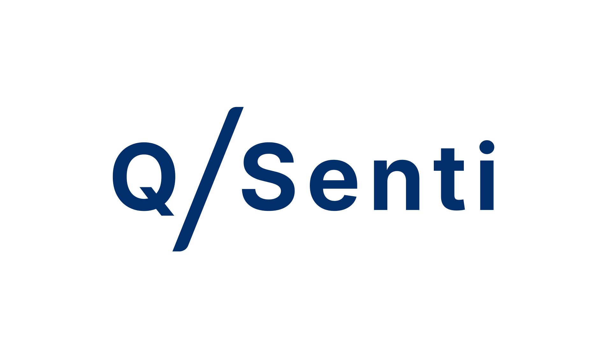

  
   
  <b>Sentiment, Quantified</b>
   
  <a href="https://quantsenti.com"> Visit the website</a>

---

> To observe nature, we need visible light. To observe humanity, we need emotion.

## 🌊 The Beginning

QuantSenti started with a simple idea: make quantified market sentiment a tool available to everyone.
We believe that when public social data is transformed into transparent, reproducible 
indicators through an auditable NLP pipeline, 
it helps all participants understand the market more rationally.

## The Pipeline

### 1. Ingestion
The system harvests public discourse. It applies statistical sampling and regex de-identification to ensure only high-intent, anonymized signals enter the system.

### 2. Dual-Engine Inference
Utilize domain-specific models for more accuracy:
- **Finance:** `FinBERT` (pre-trained on financial reports/news).
- **Social:** `RoBERTa-large` (optimized for nuanced social discourse).

### 3. Mathematical Stabilization

Time decay --- recent sentences carry more weight via exponential decay; a post from the last hour outweighs one from yesterday.

Laplace smoothing (α = 5) --- adds five virtual neutral observations, preventing a handful of early posts from producing extreme readings.

$$S = \frac{\sum (W_{pos} \cdot N_{pos}) - \sum (W_{neg} \cdot N_{neg})}{N_{total} + \alpha}$$

### 4. Storage
SQLite for live/backtest/corpus data.

## 🛡 Compliance & Ethical AI

GDPR: All Personally Identifiable Information is stripped at the edge.

EU AI Act 2026: AI tags are present on every data and visualization chart page.

Independence: We accept no sponsorship from anyone. And all features are currently free.

## 🛠 Tech Stack

- **Backend:** Python 3.11 / Django 4.x / PyTorch
- **Frontend:** HTMX / Tailwind CSS  / Vanilla JS (few)
- **Charts:** Apache ECharts 5.x 
- **Ops:** OpenResty / systemd / Gunicorn / Cloudflare

## Future

The website is currently in its trial operation phase, and the available assests and functions are limited. In the future, we plan to add a user system, a voting system, more assets, more categories, and more powerful models. This website is currently purely for public benefit, only driven by my vision.

---

   
  <code>Engineered in Uppsala, Sweden. 2026.</code>

